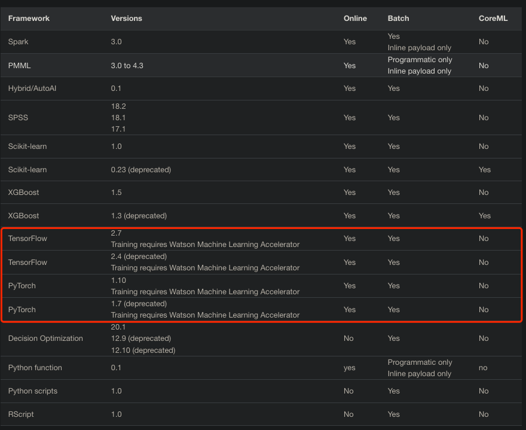
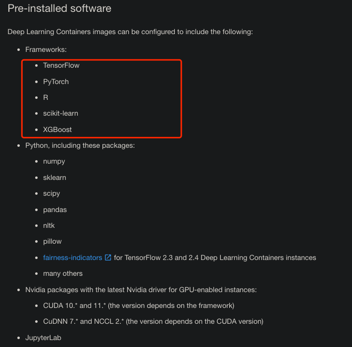
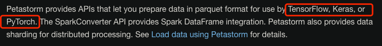
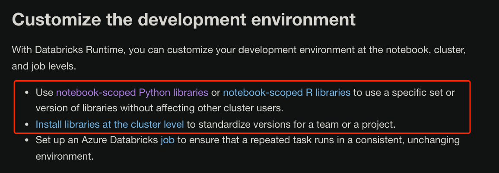
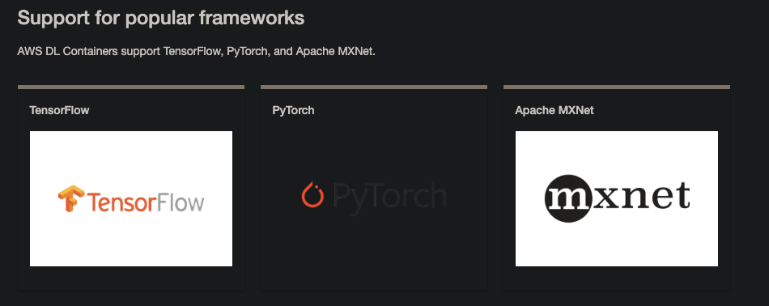

<!--
 * @Created by: Xiang Pan
 * @Date: 2022-04-23 21:45:49
 * @LastEditors: Xiang Pan
 * @LastEditTime: 2022-04-23 22:24:18
 * @Email: xiangpan@nyu.edu
 * @FilePath: /HW5/problem2/2_1.md
 * @Description: 
-->

## 2-1
IBM, Google, Microsoft, and Amazon

### IBM

Important: Deep Learning training supports a limited set of frameworks:

PyTorch

TensorFlow

### Google
If we take R, scikit-learn and XGBoost as the deep learning frameworks,

We can not find the version at their documentation.

### Microsoft

For different versions, azure provides different versions of environment.

### Amazon

As stated in the documentation, the lastest version frameworks are supported:

