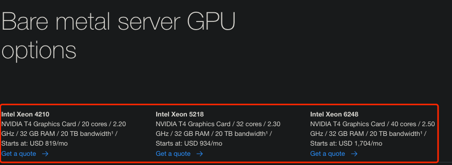
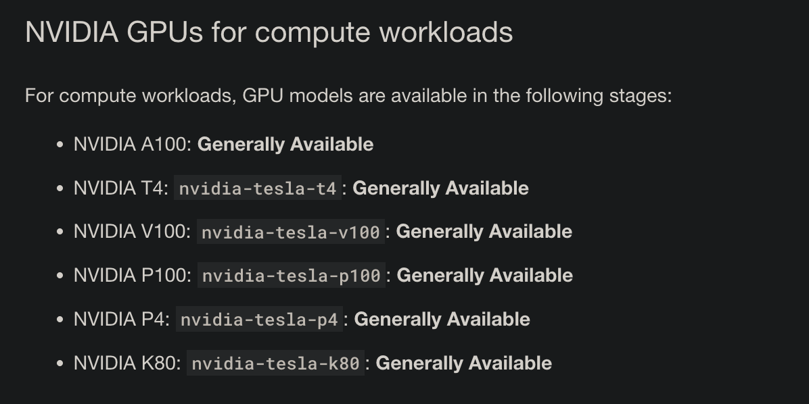
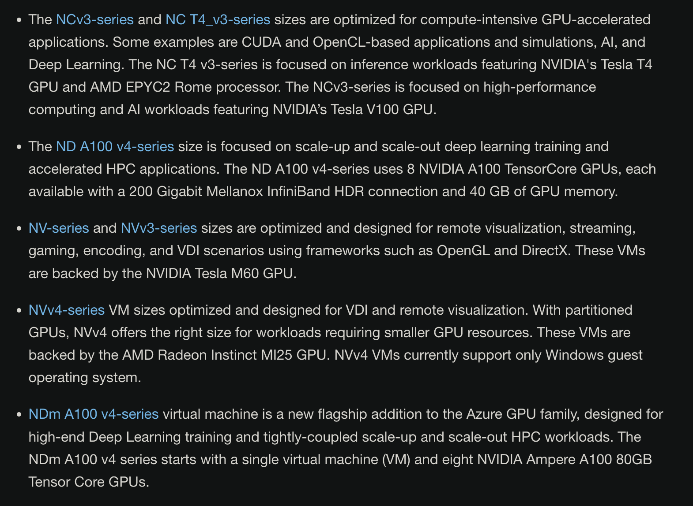
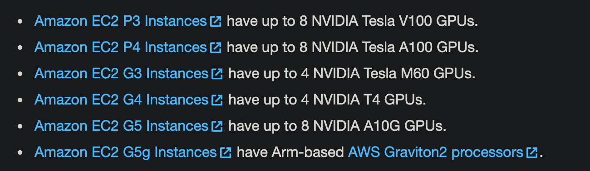

<!--
 * @Created by: Xiang Pan
 * @Date: 2022-04-23 22:24:43
 * @LastEditors: Xiang Pan
 * @LastEditTime: 2022-04-24 01:13:24
 * @Email: xiangpan@nyu.edu
 * @FilePath: /HW5/problem2/2_2.md
 * @Description: 
-->
## 2-2
IBM, Google, Microsoft, and Amazon

### IBM
Supported GPUs:

They also provide the combined option.

### Google

### Microsoft

NCv3-series: NVIDIA Tesla V100 GPU
NCasT4_v3-series: NVIDIA Tesla T4
NV-series: NVIDIA Tesla M60
NVv3-series: NVIDIA Tesla M60
NVv4-series: AMD Radeon Instinct MI25
NDm A100 v4-series: NVIDIA Ampere A100 80GB Tensor Core GPU.

### Amazon

