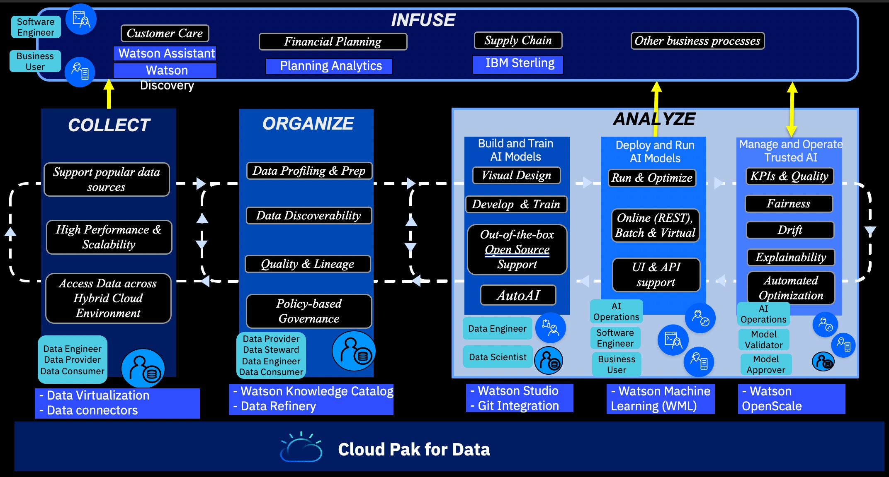
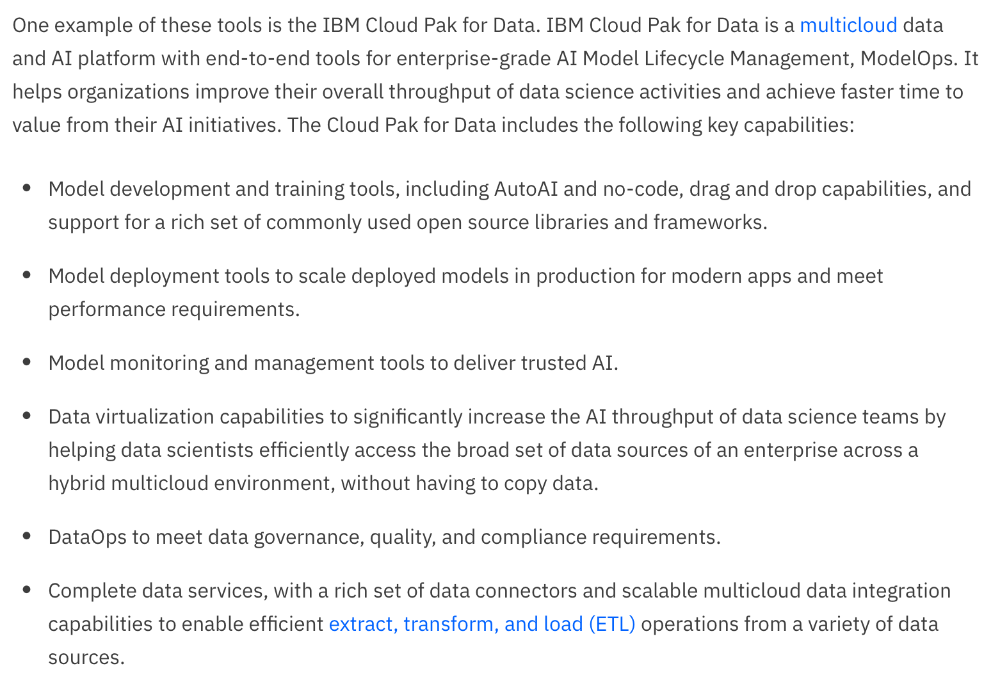
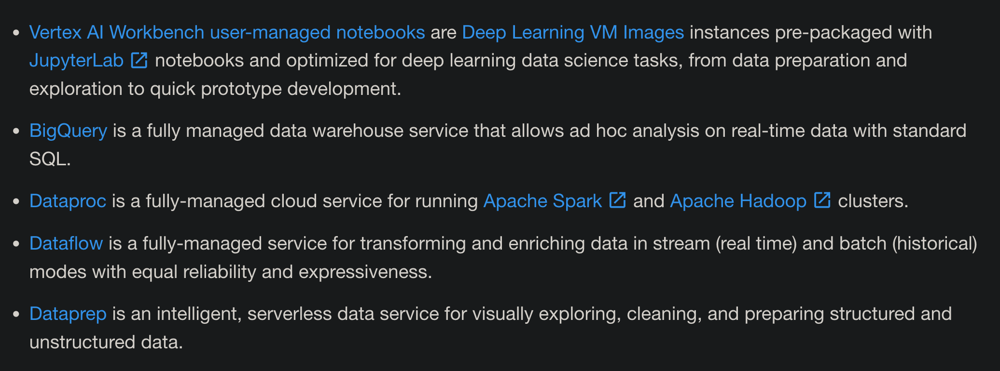
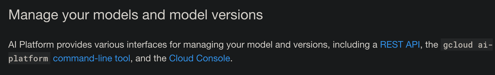
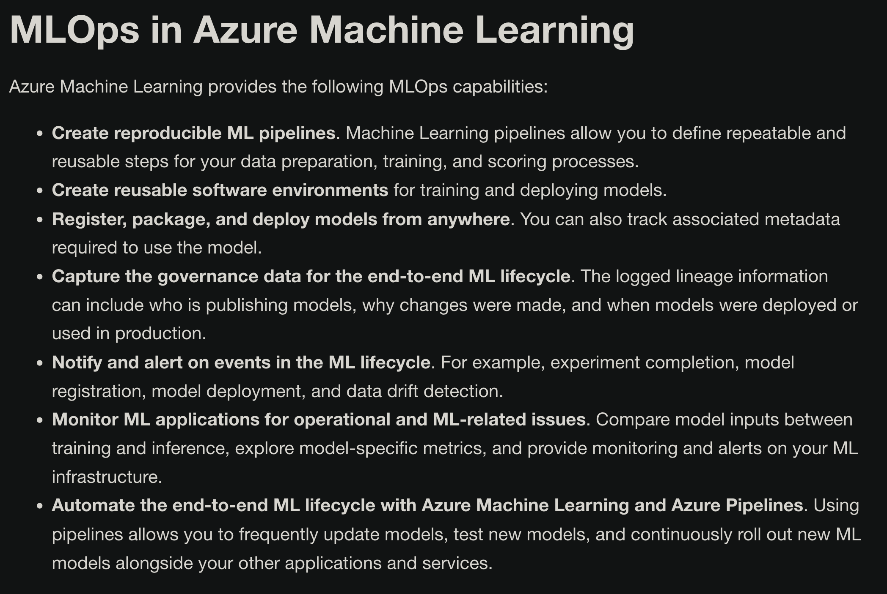
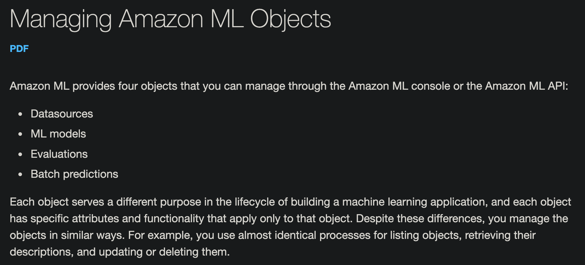

<!--
 * @Created by: Xiang Pan
 * @Date: 2022-04-24 01:14:35
 * @LastEditors: Xiang Pan
 * @LastEditTime: 2022-04-24 02:02:34
 * @Email: xiangpan@nyu.edu
 * @FilePath: /HW5/problem2/2_3.md
 * @Description: 
-->
## 2-3
Model lifecycle management: tools supported to manage ML model lifecycle.

We use the screen shot from their homepage to illustrate the tools.

### IBM

### [Google](https://cloud.google.com/ai-platform/docs/ml-solutions-overview)
Data preprocessing: 

Code Model

Monitor your prediction service:

### [Microsoft](https://docs.microsoft.com/en-us/azure/machine-learning/concept-model-management-and-deployment)
MLOps: Model management, deployment, lineage, and monitoring with Azure Machine Learning

### [Amazon](https://docs.aws.amazon.com/machine-learning/latest/dg/managing_objects.html)

