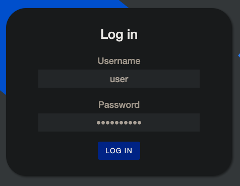
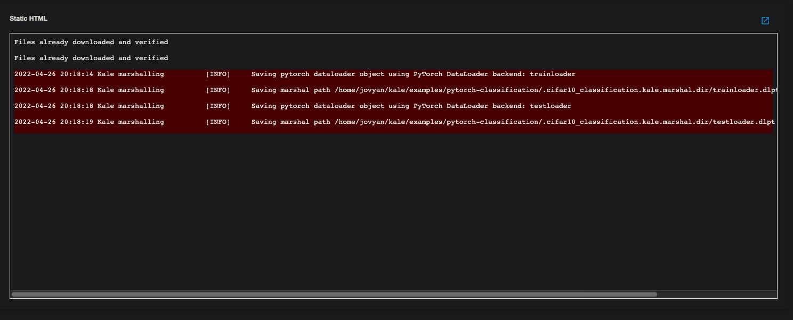

<!--
 * @Created by: Xiang Pan
 * @Date: 2022-04-24 02:32:21
 * @LastEditors: Xiang Pan
 * @LastEditTime: 2022-04-26 21:09:38
 * @Email: xiangpan@nyu.edu
 * @FilePath: /HW5/problem3/3_1.md
 * @Description: 
-->
## 3-1

### (a)

### (b)

### (c)

## 3-2

### (a)
Create a notebook server.

We need to install the pytorch and torchvision package.

Or we can choose the pytorch image from the supported list.

### (b)
Download and run the notebook: We will be using pytorch-classification notbeook from the example repo. Note that the codelab uses a di ff erent example from the repo (titanic dataset ml.ipynb). (3)

### (c) Compile
Convert your notebook to a Kubeflow Pipeline: Enable Kale and then compile and run the pipeline from Kale Deployment Panel. Show output from each of the 5 steps of the pipeline (5)

### (d)

Show snapshots of ”Graph” and ”Run output” of the experiment. (3)

I'm not sure why I do not have the output of the in the run output section, but I have the output for each of the steps.

### (e) Cleanup

Cleanup: Destroy the MiniKF VM

